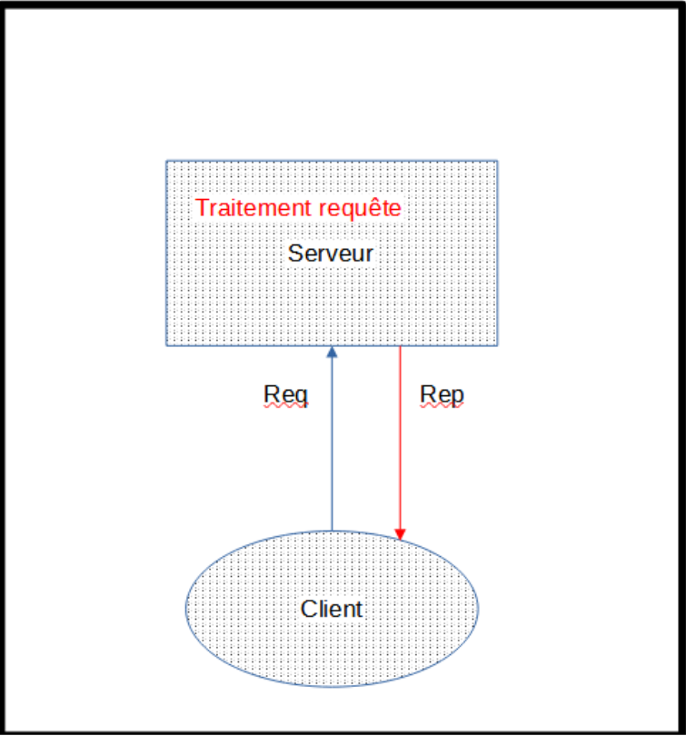

# 🚀 SAE 302 : Développer des Applications Communicantes  

## 📝 Description du projet  

Cette SAE a été réalisée du **11 au 15 décembre 2023** dans le cadre du BUT Réseaux et Télécommunications.  
Le but principal était de **concevoir et développer une application de type "réseau social" en Java**, en utilisant des fonctions de communication pour implémenter un protocole applicatif au-dessus de la pile TCP/IP.  

## 🌟 Fonctionnalités de l'application  

L'application propose les fonctionnalités suivantes :  
- 🆕 **Inscription** : Enregistrement de nouveaux utilisateurs.  
- 🔑 **Connexion** : Accès sécurisé pour les utilisateurs existants.  
- 🤝 **Demande d'amis** : Gestion des relations entre utilisateurs.  
- 💬 **Envoi de messages en temps réel** : Échanges de messages entre amis connectés.  

## ⚙️ Contraintes techniques  

Les contraintes imposées étaient les suivantes :  
- Limitation à **100 utilisateurs maximum**.  
- Chaque utilisateur peut avoir jusqu'à **10 amis**.  
- Les messages échangés sont stockés en **mémoire vive (RAM)**.  

## 🛠️ Architecture  

### 📌 Choix techniques  
- **Protocole UDP** pour la communication client-serveur, en raison de :  
  - La **simplicité** de la syntaxe.  
  - La **rapidité** des échanges via les sockets.  
- **Stockage local** : Client et serveur hébergés sur une même machine.  

### 🖼️ Schéma de l'architecture  
 *(schéma de l'architecture)* 

## 👥 Répartition des tâches  

En équipe de trois, voici les tâches que j’ai réalisées :  
- 🖊️ **Conception de l'architecture réseau et applicative**.  
- 💻 Développement des **requêtes d'inscription et de connexion**.  

## 🌱 Ce que j'ai appris  

- 📡 Utiliser le protocole **UDP** dans un cas concret.  
- ☕ Développer une application en **Java**, en respectant des contraintes précises.  
- 🤝 Collaborer efficacement en équipe.  
- 🔍 Faire preuve de **rigueur** dans la conception et le codage.  
- 🕒 Résoudre des problèmes en autonomie dans un délai limité.  

## 📂 Accéder au projet  

Ce dépôt contient :  
- 📄 Les fichiers sources Java (client et serveur).  
- ⚙️ Les configurations nécessaires au fonctionnement de l'application.  
- 📘 Le rapport complet du projet : [cr_sae_302.pdf](./cr_sae_302.pdf).  

 
